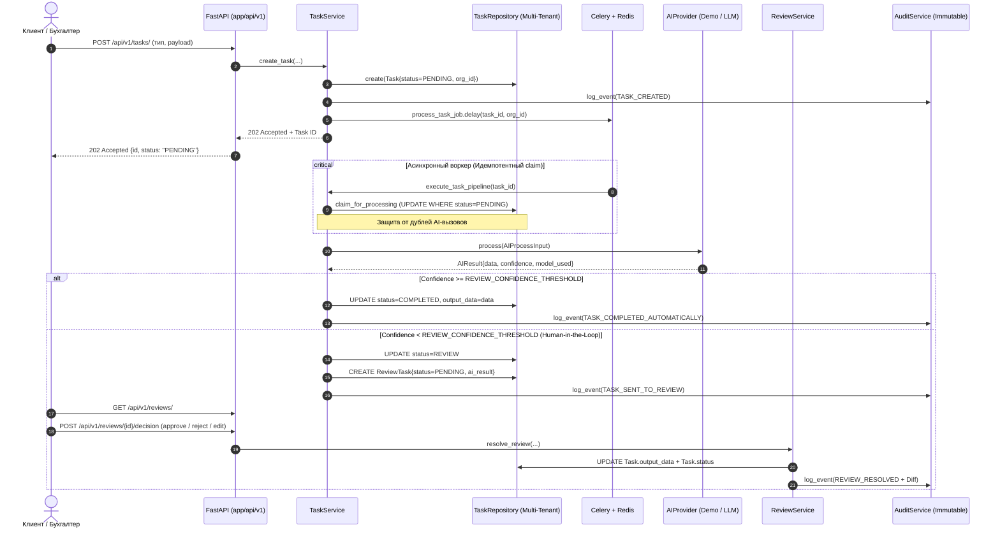

# OneFlow — Универсальный технический фундамент SaaS-платформы автоматизации

> **Назначение OneFlow**: Модульное, масштабируемое ядро для будущих решений автоматизации казахстанского учета и смежных бизнес-процессов. Ядро намеренно абстрагировано от конкретных прикладных сценариев (OCR, сопоставления номенклатур, парсинга банковских выписок, специфичных правил Kaspi/1С/ЭДО) и готово к интеграции **любой продуктовой гипотезы** в виде изолированного workflow без переписывания архитектуры.

---

## 1. Архитектурный обзор и поток данных

### Поток обработки задачи (End-to-End Pipeline)



---

## 2. Стек технологий и обоснование решений

* **Backend**: **Python 3.12+ / FastAPI / Pydantic v2**
  * Строгая статическая типизация, высокая производительность асинхронного ввода-вывода (ASGI).
* **База данных**: **PostgreSQL 16 + SQLAlchemy 2.0 (Async) + Alembic**
  * `JSONB` для гибких схем входных и выходных данных задач без изменения структуры таблиц.
  * Триггерная защита на уровне PostgreSQL (`BEFORE UPDATE OR DELETE ON audit_logs`), гарантирующая неизменяемость (immutability) журнала аудита.
  * Для локальной разработки и unit/smoke тестов поддерживается zero-setup режим на `SQLite + aiosqlite` с аналогичными триггерами неизменяемости.
* **Очередь задач**: **Celery + Redis**
  * *Почему Celery, а не FastAPI BackgroundTasks*: AI-вызовы и тяжелые алгоритмические обработки могут занимать от единиц до десятков секунд. Выполнение их внутри HTTP-сервера исчерпывает пул обработчиков и приводит к потере задач при редеплое или падении сервера. Celery выносит задачи в изолированные воркеры с поддержкой очередей, ограничений повторных попыток (retries) и таймаутов.
  * *Идемпотентность*: Воркер атомарно переводит статус задачи из `PENDING` в `PROCESSING`. Если задача уже была захвачена или выполнена, повторный AI-вызов блокируется.
  * *Режим тестирования*: Для локальных тестов без Redis поддерживается `CELERY_TASK_ALWAYS_EAGER=true`.
* **Frontend**: **Vue 3 + TypeScript + Vite + Pinia + Naive UI**
  * *Почему Naive UI, а не PrimeVue*:
    1. Написан на 100% на TypeScript специально под Vue 3 — максимальная автодополняемость и надежность типов.
    2. Полноценная поддержка Dark/Light тем «из коробки» без внешних громоздких CSS-пресетов через `NConfigProvider`.
    3. Идеальный набор компонентов для B2B/SaaS (`NDataTable`, `NStatistic`, `NBadge`, `NModal`, `NUpload`).
  * *Решение проблемы SameSite для refresh-cookie*:
    В режиме разработки Vite использует reverse proxy (`/api` -> `http://localhost:8000`). Фронтенд обращается к бэкенду как к first-party источнику (`http://localhost:5173/api/...`), благодаря чему `SameSite=Lax` и `httpOnly` куки работают штатно без CORS/SameSite блокировок браузера.
* **Хранилище файлов**:
  * Абстракция `StorageBackend` с реализацией `LocalStorageBackend` для MVP и готовой точкой расширения под S3/MinIO.
  * Проверка MIME-типов по содержимому (magic-байты заголовков файлов: `%PDF-`, `\x89PNG`, `\xff\xd8\xff`, `PK\x03\x04`), исключающая загрузку замаскированных исполняемых файлов (.exe/.sh).
  * Soft-delete (`deleted_at`) для сохранения файла в целях финансово-хозяйственного аудита.

---

## 3. Структура проекта

```text
RPROJECT X/
├── backend/
│   ├── app/
│   │   ├── api/v1/             # HTTP роуты (auth, tasks, review, files, dashboard, audit)
│   │   │                       # Внимание: api/ НЕ импортирует models/ и repositories/ напрямую!
│   │   ├── core/               # Конфиг (Settings), безопасность (JWT/bcrypt), сессии БД
│   │   ├── models/             # SQLAlchemy 2.0 декларативные модели
│   │   ├── schemas/            # Pydantic v2 схемы запросов и ответов
│   │   ├── services/           # Бизнес-логика, FSM-переходы, Diff-анализ
│   │   ├── repositories/       # Доступ к БД с жестким контролем multi-tenancy (BaseRepository)
│   │   ├── workers/            # Celery задачи и конфигурация
│   │   ├── integrations/       # StorageBackend (Local, S3) и валидация файлов
│   │   └── ai/                 # AIProvider: контракты, DemoAIProvider, LLMProvider
│   ├── alembic/                # Миграции структуры БД
│   ├── scripts/                # seed.py (наполнение тестовыми данными)
│   ├── tests/                  # Pytest smoke и интеграционные тесты
│   ├── Dockerfile
│   └── requirements.txt
├── frontend/
│   ├── src/
│   │   ├── api/                # Axios клиент с интерцептором 401 и авто-обновлением токена
│   │   ├── components/         # StatusBadge, AppLayout
│   │   ├── router/             # Маршрутизация с guards авторизации
│   │   ├── stores/             # Pinia stores (auth, theme)
│   │   ├── types/              # TypeScript интерфейсы
│   │   └── views/              # Login, Dashboard, Tasks, TaskDetail, Review, Files, Settings
│   ├── Dockerfile
│   ├── nginx.conf
│   └── package.json
├── docker-compose.yml          # Оркестрация: backend, frontend, postgres, redis, celery
├── .env.example                # Шаблон конфигурации
└── README.md
```

---

## 4. Переменные окружения (.env)

| Переменная | Значение по умолчанию | Описание |
| :--- | :--- | :--- |
| `ENV` | `development` | Окружение запуска (`development`, `production`, `test`) |
| `DEBUG` | `true` | Флаг отладочного режима |
| `DATABASE_URL` | `sqlite+aiosqlite:///./saas.db` | Строка подключения к БД (SQLite локально или PostgreSQL в проде/Docker) |
| `REDIS_URL` | `redis://localhost:6379/0` | URL подключения к Redis брокеру |
| `CELERY_BROKER_URL` | `redis://localhost:6379/0` | URL очереди Celery |
| `CELERY_RESULT_BACKEND` | `redis://localhost:6379/0` | URL бэкенда результатов Celery |
| `CELERY_TASK_ALWAYS_EAGER` | `false` | Если `true`, задачи выполняются синхронно в процессе (для тестов) |
| `JWT_SECRET_KEY` | *(строка 32+ символа)* | Секретный ключ подписи JWT токенов |
| `ACCESS_TOKEN_EXPIRE_MINUTES` | `15` | Время жизни короткоживущего Access Token |
| `REFRESH_TOKEN_EXPIRE_DAYS` | `7` | Время жизни Refresh Token (в httpOnly cookie) |
| `COOKIE_NAME` | `refresh_token` | Имя куки для refresh токена |
| `COOKIE_SAMESITE` | `lax` | Политика SameSite (`lax`, `none`, `strict`) |
| `COOKIE_SECURE` | `false` | Флаг Secure для HTTPS (в проде обязательно `true`) |
| `REVIEW_CONFIDENCE_THRESHOLD` | `0.85` | **Порог уверенности AI**: задачи с confidence ниже этого значения уходят на проверку человеку |
| `DEMO_MODE` | `true` | Режим работы без внешних платных LLM ключей |
| `AI_PROVIDER` | `demo` | Выбранный провайдер (`demo` или `llm`) |
| `OPENAI_API_KEY` | `""` | Ключ доступа к OpenAI-совместимому API (при `AI_PROVIDER=llm`) |
| `STORAGE_BACKEND` | `local` | Тип хранилища файлов (`local` или `s3`) |
| `UPLOAD_DIR` | `./uploads` | Локальный каталог сохранения файлов |
| `MAX_UPLOAD_SIZE_BYTES` | `26214400` | Максимальный размер загружаемого файла (25 МБ) |
| `CORS_ORIGINS` | `["http://localhost:5173", ...]` | Явный список доверенных источников CORS |

---

## 5. Быстрый запуск

### Вариант А: Запуск через Docker (одной командой)

Требуется установленный Docker и Docker Compose.

```bash
# 1. Склонировать репозиторий и подготовить .env
cp .env.example .env

# 2. Запустить все сервисы (PostgreSQL, Redis, Celery, Backend, Frontend)
docker compose up --build
```

* Веб-интерфейс доступен по адресу: **http://localhost:5173** (или http://localhost)
* API Swagger / Документация: **http://localhost:8000/docs**
* Healthcheck: **http://localhost:8000/health**

---

### Вариант Б: Запуск локально без Docker

#### 1. Backend

```bash
cd backend

# Создать и активировать виртуальное окружение
python -m venv .venv
# Windows:
.\.venv\Scripts\activate
# Linux/macOS:
# source .venv/bin/activate

# Установить зависимости
pip install -r requirements.txt

# Наполнить БД демонстрационными данными (SQLite создается автоматически)
python scripts/seed.py

# Запустить API сервер
uvicorn app.main:app --reload --port 8000
```

#### 2. Frontend

```bash
cd frontend

# Установить зависимости
npm install

# Запустить dev-сервер с настроенным проксированием
npm run dev
```

Откройте в браузере: **http://localhost:5173**

---

### Тестовые учетные записи (после `seed.py`):

1. **Организация 1 (ТОО Базис-Аудит)**:
   * Администратор: `admin@example.kz` / Пароль: `Secret123!`
   * Бухгалтер: `user@example.kz` / Пароль: `Secret123!`
2. **Организация 2 (ТОО Степь Логистик)** — для проверки мультиарендности:
   * Администратор: `other@example.kz` / Пароль: `Secret123!`

---

## 6. Запуск тестов

Тестовый набор покрывает регистрацию, аутентификацию, httpOnly refresh cookie, multi-tenancy изоляцию, конечный автомат (FSM), Human-in-the-Loop Review, валидацию файлов по сигнатурам и триггеры неизменяемости аудита:

```bash
cd backend
.\.venv\Scripts\pytest -v
```

---

## 7. Руководства по расширению платформы

### Инструкция: Как добавить новый Task Type

1. Откройте `backend/app/models/entities.py` и добавьте новое значение в `TaskType`:
   ```python
   class TaskType(str, enum.Enum):
       # Существующие типы...
       KASPI_STATEMENT_IMPORT = "KASPI_STATEMENT_IMPORT"
   ```
2. Откройте `frontend/src/types/index.ts` и добавьте новый тип в TypeScript enum:
   ```typescript
   export type TaskType = 
     | 'DOCUMENT_PROCESSING'
     | 'KASPI_STATEMENT_IMPORT';
   ```
3. В `frontend/src/views/TasksView.vue` добавьте элемент в `typeOptions`:
   ```typescript
   { label: 'KASPI_STATEMENT_IMPORT', value: 'KASPI_STATEMENT_IMPORT' }
   ```
Ядро, FSM-автомат и очередь готовы обрабатывать этот тип без каких-либо изменений логики!

---

### Инструкция: Как добавить новый AI Workflow, не трогая ядро

1. Откройте `backend/app/ai/` и добавьте обработчик для нового типа в `AIProvider` или создайте кастомный провайдер в `backend/app/ai/custom_provider.py`:
   ```python
   from app.ai.provider import AIProvider
   from app.ai.schemas import AIProcessInput, AIResult

   class CustomWorkflowProvider(AIProvider):
       async def process(self, input_data: AIProcessInput) -> AIResult:
           if input_data.task_type == "KASPI_STATEMENT_IMPORT":
               # Кастомная логика парсинга/модели
               return AIResult(
                   data={"extracted_operations": 42},
                   confidence=0.92,
                   model_used="kaspi-transformer-v1"
               )
           # Fallback...
   ```
2. Зарегистрируйте новый провайдер в фабрике `backend/app/ai/factory.py`.
3. Все сервисы (`TaskService`, `ReviewService`), воркеры и API продолжат работать с новым workflow прозрачно!

---

### Инструкция: Как заменить LocalStorage на S3 / MinIO

1. Создайте класс `S3StorageBackend` в `backend/app/integrations/storage/s3.py`, реализующий интерфейс `StorageBackend`:
   ```python
   import aioboto3
   from app.integrations.storage.base import StorageBackend

   class S3StorageBackend(StorageBackend):
       def __init__(self, bucket: str, endpoint_url: str = None):
           self.bucket = bucket
           self.endpoint_url = endpoint_url
           self.session = aioboto3.Session()

       async def save(self, file_bytes: bytes, filename: str, organization_id: str) -> str:
           key = f"{organization_id}/{filename}"
           async with self.session.client("s3", endpoint_url=self.endpoint_url) as s3:
               await s3.put_object(Bucket=self.bucket, Key=key, Body=file_bytes)
           return key

       async def get(self, stored_path: str) -> bytes:
           async with self.session.client("s3", endpoint_url=self.endpoint_url) as s3:
               resp = await s3.get_object(Bucket=self.bucket, Key=stored_path)
               return await resp["Body"].read()

       async def delete(self, stored_path: str) -> bool:
           async with self.session.client("s3", endpoint_url=self.endpoint_url) as s3:
               await s3.delete_object(Bucket=self.bucket, Key=stored_path)
               return True

       async def get_url(self, stored_path: str) -> str:
           async with self.session.client("s3", endpoint_url=self.endpoint_url) as s3:
               return await s3.generate_presigned_url("get_object", Params={"Bucket": self.bucket, "Key": stored_path})
   ```
2. В файле `backend/app/integrations/storage/factory.py` подключите создание `S3StorageBackend` при `settings.STORAGE_BACKEND == "s3"`.
3. Ни один сервис (`FileService`) и ни один HTTP-эндпоинт не требуют изменений!

---

## 8. Интеграция с 1С:Предприятие (1C OData, Tool Registry & Adapter Interface)

Интеграция выполнена как модульный слой `app/integrations/onec/`, реализующий паттерн:
```
Client / LLM / UI
       │
       ▼
[ Tool Registry & Discovery ]  (GET /api/v1/tools, Pydantic JSON Schemas)
       │
       ▼
[ ToolExecutionService Pipeline ]
   ├── 1. Tool Resolution & Pydantic Input Validation (422)
   ├── 2. Security Policy & Risk Ceiling Check (403)
   ├── 3. Dry-Run Simulation Branch (Без внешних вызовов)
   ├── 4. OneCAdapter Invocation (ODataAdapter / MockAdapter)
   ├── 5. Output Sanitization & Redaction (БИН/ИИН/IBAN маскирование)
   └── 6. Immutable AuditLog & ToolCall Telemetry
       │
       ▼
[ OneCAdapter Interface ]
   ├── ODataAdapter (HTTPX asyncio.to_thread -> onec-odata OData v3)
   └── MockAdapter (Детерминированная эмуляция для тестов и Demo-режима)
```

### Архитектурные особенности:

1. **Единый OneCAdapter интерфейс**:
   * Бизнес-операции и инструменты не содержат веток `if is_mock`. 
   * `ODataAdapter` и `MockAdapter` реализуют единый абстрактный контракт `OneCAdapter`. При отсутствии URL в конфигурации мок-режим включается прозрачно на уровне адаптера.
2. **Типизированный Tool Registry**:
   * Каждый инструмент имеет статически валидируемую Pydantic-схему параметров (`input_schema_class`), описание, риск-уровень и краткое резюме структуры вывода (`output_summary`).
   * Безусловно запрещенные операции (`raw_odata_query`, direct SQL, etc.) отвергаются **при регистрации в реестре** (`ToolRegistry.register`), исключая их появление в рантайме.
3. **Безопасность учетных записей (Credentials Encryption)**:
   * Пароли подключений к 1С в таблице `organizations.onec_config` сохраняются исключительно в зашифрованном виде с использованием симметричного шифрования Fernet (`ONEC_CREDENTIALS_ENCRYPTION_KEY`).
   * Пароли никогда не отдаются в GET API и не логируются в открытом виде в `audit_logs` или `tool_calls`.
4. **Защита от SSRF (Server-Side Request Forgery)**:
   * Эндпоинты настройки подключения к 1С (`PUT /onec-connection`) строго проверяют адрес сервера: запрещены loopback (`localhost`, `127.0.0.1`), приватные диапазоны RFC 1918 (10.0.0.0/8, 172.16.0.0/12, 192.168.0.0/16), Docker-сервисы (`postgres`, `redis`, `backend`) и облачные метаданные.
5. **Тенант-уровневые потолки риска**:
   * Организация может задать собственное ограничение `max_onec_risk_level`. Принцип: организация может быть **строже** глобального лимита (`ONEC_MAX_RISK_LEVEL`), но никогда не может быть мягче его (`min(global_ceiling, org_ceiling)`).
6. **Ролевое разграничение (RBAC)**:
   * Чтение статуса подключения и запуск инструментов доступны всем авторизованным пользователям организации.
   * Изменение параметров подключения к 1С и проверка неподтвержденных кредов требуют роли `ADMIN` (`require_admin`).

### Как подключить 1С для локальной разработки:

1. **Вариант 1 (Облачный 1C:Fresh триал)**:
   * Зарегистрируйте бесплатный 30-дневный демо-доступ на [1cfresh.kz](https://1cfresh.kz) или [1cfresh.com](https://1cfresh.com).
   * В личном кабинете скопируйте URL опубликованного приложения (например, `https://1cfresh.kz/a/buhkz/odata/standard.odata`).
   * В настройках организации (экран «Настройки» в веб-интерфейсе OneFlow) укажите URL, логин и пароль.
2. **Вариант 2 (Локальная база с веб-публикацией OData)**:
   * В 1С:Предприятие (версия 8.3.14+) откройте конфигуратор базы («Бухгалтерия для Казахстана»).
   * Выберите: **Администрирование → Публикация на веб-сервере...**.
   * Укажите имя публикации (`accounting`) и отметьте **«Публиковать стандартный интерфейс OData»**.
   * Нажмите «Опубликовать».
3. **Вариант 3 (Режим Demo/Mock без установленной 1С)**:
   * Если URL 1С не настроен, OneFlow автоматически использует `MockAdapter`, возвращающий детерминированные казахстанские учетные данные (БИН/ИИН, суммы KZT, IBAN) для бесперебойного локального тестирования.

### Модель уровней риска (Risk Levels):

* **L0 (`SAFE_READ`)**: Метаданные, проверка связи, нечувствительные справочники (`read.system.health_check`, `read.documents.get_unposted`).
* **L1 (`ANALYTICS_READ`)**: Сводные отчеты, остатки по складам, задолженность (`read.analytics.get_debtors`, `read.warehouse.get_inventory`).
* **L2 (`SENSITIVE_READ`)**: Персональные данные, зарплатные ведомости, банковские счета.
* **L3 (`WRITE_DRAFT`)** / **L4 (`WRITE_POST`)** / **L5 (`DESTRUCTIVE`)**: Модифицирующие операции.

> [!IMPORTANT]
> **Двойной предохранитель записи (Dual-Safety Latch)**:
> Запись в 1С **заблокирована по умолчанию** глобальным флагом `ONEC_READ_ONLY_MODE=true`. Любая модифицирующая операция отклоняется до сетевого вызова.

---

## 9. Tool Execution & Discovery API

### 1. Discovery инструментов:
* `GET /api/v1/tools`
* Возвращает список всех зарегистрированных инструментов с их метаданными, уровнем риска и Pydantic JSON Schema параметров.

### 2. Запуск инструмента:
* `POST /api/v1/tools/execute`
* Тело запроса:
  ```json
  {
    "tool_name": "read.analytics.get_debtors",
    "params": {
      "min_debt": 500000.0,
      "limit": 20
    },
    "dry_run": false
  }
  ```
* Если `"dry_run": true`, система валидирует схему и проверяет политики доступа, но **не обращается к 1С/адаптеру** и возвращает:
  ```json
  {
    "tool": "read.analytics.get_debtors",
    "risk_level": "ANALYTICS_READ",
    "data": null,
    "is_truncated": false,
    "is_mock": false,
    "dry_run": true
  }
  ```

### 3. История вызовов и телеметрия:
* `GET /api/v1/tools/history?limit=50`
* Возвращает журнал вызовов текущей организации (статус, latency_ms, параметры, флаг dry_run, ошибки).

### 4. Управление подключением 1С:
* `GET /api/v1/onec-connection` — просмотр статуса подключения (без пароля).
* `PUT /api/v1/onec-connection` (Admin) — сохранение параметров с Fernet-шифрованием и SSRF-валидацией.
* `POST /api/v1/onec-connection/test-connection` (Admin) — тестовая проверка связи перед сохранением.

---

## 10. Пошагово: Как добавить новый инструмент в Tool Registry

1. Откройте `backend/app/integrations/onec/tools.py`.
2. Создайте строго типизированную Pydantic-схему входных параметров:
   ```python
   class TurnoverBalanceInput(BaseModel):
       account_code: str = Field(default="3310", description="Номер бухгалтерского счета")
       limit: int = Field(default=50, ge=1, le=100, description="Максимум строк")
   ```
3. Реализуйте функцию-исполнитель (принимающую `adapter: OneCAdapter` и валидированные параметры):
   ```python
   async def _exec_turnover_balance(adapter: OneCAdapter, params: TurnoverBalanceInput) -> Any:
       return await adapter.list_accumulation_register(
           "Хозрасчетный_Обороты", top=params.limit
       )
   ```
4. Зарегистрируйте инструмент в глобальном реестре:
   ```python
   registry.register(
       ToolDefinition(
           name="read.analytics.get_turnover_balance",
           description="Анализ оборотно-сальдовой ведомости по счету учета.",
           risk_level=RiskLevel.ANALYTICS_READ,
           input_schema_class=TurnoverBalanceInput,
           output_summary="Список оборотов по счету с суммами дебета и кредита.",
       ),
       _exec_turnover_balance,
   )
   ```
5. Новый инструмент автоматически:
   * Появится в `GET /api/v1/tools` с готовой JSON-схемой для LLM и UI.
   * Будет доступен для вызова через `POST /api/v1/tools/execute`.
   * Получит поддержку режима `dry_run=true`.
   * Будет проверен на лимит риска организации и глобальный предохранитель.
   * Пройдет через автоматическое маскирование БИН/ИИН/IBAN.
   * Зафиксирует факт исполнения в `audit_logs` и таблице `tool_calls`.

---

## 11. Подключение внешних агентов через MCP (Model Context Protocol)

OneFlow предоставляет стандартизированный MCP-интерфейс к Tool Registry платформы, позволяющий внешним AI-агентам (Claude Desktop, Cursor IDE, LangChain, AutoGen, CrewAI) безопасно взаимодействовать с 1С через OneFlow как единый шлюз безопасности, изоляции тенантов и аудита.

### Архитектурные гарантии шлюза MCP:
* **Multi-Tenancy**: Вызовы жестко привязаны к `organization_id` из JWT-токена агента. Доступ к чужим базам 1С технически невозможен.
* **Канонический пайплайн защиты (`GuardedExecutionPipeline`)**: Все MCP-вызовы проходят проверку `FORBIDDEN_OPERATIONS`, проверку лимита риска организации (`max_onec_risk_level`), глобальный режим Read-Only (`ONEC_READ_ONLY_MODE=true`) и автоматическое маскирование БИН/ИИН/IBAN.
* **Сквозная телеметрия**: Все вызовы через MCP помечаются `source="mcp"` и сохраняются в `tool_calls` и неизменяемом журнале `audit_logs` с миллисекундным зазором задержки.

---

### Инструкция по получению токена доступа

1. Выполните вход через API авторизации для получения JWT Access Token:
   ```bash
   curl -X POST http://localhost:8000/api/v1/auth/login \
     -H "Content-Type: application/json" \
     -d '{"email": "admin@yourcompany.kz", "password": "YourPassword123"}'
   ```
2. Скопируйте поле `access_token` из JSON-ответа.

---

### Конфигурация для Claude Desktop (`claude_desktop_config.json`)

Файл конфигурации расположен по пути:
* **Windows**: `%APPDATA%\Claude\claude_desktop_config.json`
* **macOS**: `~/Library/Application Support/Claude/claude_desktop_config.json`

#### Вариант А: Прямое подключение по SSE (рекомендуется)
```json
{
  "mcpServers": {
    "oneflow": {
      "url": "http://localhost:8000/mcp/sse?token=ВАШ_JWT_ACCESS_TOKEN"
    }
  }
}
```

#### Вариант Б: Через stdio-мост `mcp-proxy` (npx)
```json
{
  "mcpServers": {
    "oneflow": {
      "command": "npx",
      "args": [
        "-y",
        "@modelcontextprotocol/server-sse",
        "http://localhost:8000/mcp/sse?token=ВАШ_JWT_ACCESS_TOKEN"
      ]
    }
  }
}
```

---

### Конфигурация для Cursor IDE (`.cursor/mcp.json`)

В корне вашего проекта создайте или отредактируйте файл `.cursor/mcp.json`:

#### Вариант А: SSE транспорт
```json
{
  "mcpServers": {
    "oneflow-sse": {
      "url": "http://localhost:8000/mcp/sse?token=ВАШ_JWT_ACCESS_TOKEN",
      "transport": "sse"
    }
  }
}
```

#### Вариант Б: Streamable HTTP (JSON-RPC) транспорт
```json
{
  "mcpServers": {
    "oneflow-http": {
      "url": "http://localhost:8000/mcp",
      "headers": {
        "Authorization": "Bearer ВАШ_JWT_ACCESS_TOKEN"
      }
    }
  }
}
```

---

### Доступные эндпоинты MCP шлюза

* `GET /mcp` — метаданные сервера, статус и список поддерживаемых протоколов.
* `POST /mcp` — Streamable HTTP транспорт (JSON-RPC 2.0). Принимает методы `initialize`, `tools/list`, `tools/call`.
* `GET /mcp/sse` — Server-Sent Events транспорт для потокового получения сообщений от сервера.
* `POST /mcp/messages?session_id=...` — прием сообщений от клиентов, подключенных по SSE.

---

---

## 12. Надежность исполнения и защита шлюза (Execution Reliability & Gateway Hardening)

Для гарантии стабильности production-интеграций с 1С:Предприятием и внешними AI-агентами шлюз OneFlow реализует комплексный слой отказоустойчивости и защиты:

### 1. Идемпотентность и защита от параллельных вызовов (In-Flight Claims)
* **Защита от дублей**: Клиент передает ключ идемпотентности через HTTP-заголовок `X-Idempotency-Key` или MCP `params._meta.idempotency_key`.
* **In-Flight Claim**: Перед стартом пайплайна в таблице `tool_calls` атомарно создается запись со статусом `status="RUNNING"`. Если поступает параллельный запрос с тем же ключом:
  * В статусе `RUNNING` — немедленный отказ с кодом **HTTP 409 Conflict** (или MCP `isError=True`, `error_code: "RATE_LIMITED"`). Повторный вызов 1С блокируется.
  * В статусе `SUCCESS` — возврат закэшированного результата без повторного обращения к 1С.
  * В статусе `FAILED` / `BLOCKED` — запрос перезахватывается для повторной попытки.
* **Индекс**: Композитный индекс `ix_tool_calls_org_idempotency` на `(organization_id, idempotency_key)` обеспечивает многопользовательскую изоляцию.

### 2. Сквозная трассировка запросов (Correlation IDs)
* Клиентский идентификатор запроса передается через `X-Request-ID` (HTTP) или извлекается из JSON-RPC `id` / `_meta.request_id` (MCP).
* Если заголовок отсутствует, шлюз генерирует уникальный UUID.
* Идентификатор возвращается клиенту в заголовке ответа `X-Request-ID`, теле ответа `request_id`, а также сквозным образом фиксируется в таблицах `tool_calls` и `audit_logs`.

### 3. Таксономия структурированных ошибок и Safe Error Masking
* **Перечисление `ToolErrorCode`**:
  * `VALIDATION_ERROR` (HTTP 422, MCP `isError=True`) — несоответствие входных параметров Pydantic-схеме.
  * `POLICY_VIOLATION` (HTTP 403, MCP `isError=True`) — превышение риск-лимита тенанта или запрещенная операция.
  * `TOOL_NOT_FOUND` (HTTP 404, MCP `isError=True`) — неизвестный инструмент в Tool Registry.
  * `ADAPTER_ERROR` (HTTP 502, MCP `isError=True`) — сетевые сбои OData-адаптера 1С.
  * `TIMEOUT_ERROR` (HTTP 504, MCP `isError=True`) — превышение таймаута операции.
  * `RATE_LIMITED` (HTTP 409, MCP `isError=True`) — конфликт параллельного выполнения по ключу идемпотентности.
  * `INTERNAL_ERROR` (HTTP 502, MCP `isError=True`) — непредвиденные внутренние ошибки.
* **Безопасное маскирование (Safe Masking)**: Внутренние строки подключений, IP-адреса, учетные записи и стектрейсы OData логируются строго на сервере (`logger.exception`). Клиенту возвращается безопасное сообщение без утечки инфраструктурных деталей.

### 4. Таймауты и ограниченные повторы (Timeouts & Bounded Retries)
* **Таймаут выполнения**: Конфигурируется параметром `ONEC_TOOL_TIMEOUT_SECONDS` (по умолчанию 30с) через `asyncio.wait_for`.
* **Ограниченные повторы (Retries)**: Параметр `ONEC_TOOL_RETRIES` (по умолчанию 1) автоматически повторяет восстановимые сбои (`ToolAdapterError`, `ToolTimeoutError`) со свежим экземпляром адаптера и паузой 0.5с. Каждая попытка сохраняется в `tool_calls` под общим `request_id` для аудита.
* **Гарантированное закрытие сессий**: Адаптер OData надежно освобождает соединения в блоке `finally` на всех ветках исполнения.

### 5. Динамическое сокрытие инструментов по риск-лимиту тенанта
* Метод `list_tools_for_tenant()` вычисляет эффективный потолок риска `min(global_ceiling, org_ceiling)`.
* Инструменты, превышающие эффективный риск организации (например, `ANALYTICS_READ` при лимите `SAFE_READ`), полностью скрываются из выдачи `GET /api/v1/tools` и MCP `tools/list`.

### 6. Защита шлюза MCP SSE
* **Маскирование токенов в логах (`TokenMaskFilter`)**: Фильтр логирования автоматически цензурирует параметры `?token=...` в URL и аргументах access-логов (`token=***`).
* **Лимит одновременных SSE-сессий**: Ограничение `MAX_SSE_SESSIONS = 1000`. При исчерпании лимита возвращается `HTTP 503 Service Unavailable`.
* **Таймаут неактивности (Idle TTL)**: Сессии с неактивностью более 30 минут (`SSE_SESSION_TTL_SECONDS = 1800`) автоматически удаляются.
* **Потокобезопасность**: Управление коллекцией активных сессий защищено через `asyncio.Lock`.
* **Совместимость с протоколом**: Эхо версии протокола `protocolVersion` в методе `initialize` и обработка уведомления `notifications/cancelled`.

---

## 13. Источники и лицензии сторонних материалов

* **onec-odata** (Python, MIT License, автор: Eugene Finskiy)
  * Репозиторий: [https://github.com/efinskiy/onec-odata](https://github.com/efinskiy/onec-odata)
  * Роль: Внешняя библиотека-зависимость в `requirements.txt` для прямого взаимодействия с OData v3 1С:Предприятия.
* **ashybulakstroy-mcp-1c-bridge** (Python, MIT License)
  * Репозиторий: [https://github.com/ashybulakstroy/ashybulakstroy-mcp-1c-bridge](https://github.com/ashybulakstroy/ashybulakstroy-mcp-1c-bridge)
  * Роль: Источник концепций безопасности (шкала уровней риска L0-L5, список безусловно запрещенных операций, маскирование конфиденциальных данных перед передачей в LLM). Реализовано независимо на архитектуре проекта.
* **1c-odata-mcp** (TypeScript, MIT License)
  * Репозиторий: [https://github.com/evilbruce666/1c-odata-mcp](https://github.com/evilbruce666/1c-odata-mcp)
  * Роль: Источник паттернов безопасности (двойной предохранитель записи, учет особенности OData с символом `+` / `%20`, таксономия наименования операций `read.<category>.<action>`).

Полный текст лицензий и официальные уведомления зафиксированы в файле [THIRD_PARTY_NOTICES.md](file:///c:/Users/timur/OneDrive/Рабочий%20стол/RPROJECT%20X/THIRD_PARTY_NOTICES.md).

## Daily Guard (foundation)

Daily Guard runs conservative, read-only diagnostics against a tenant's 1C data. Its first stage stores rule observations as persistent findings; it does not produce AI explanations or write to 1C.

```text
1C
↓
Diagnostic Rules
↓
DailyGuardService
↓
FindingRepository
↓
Findings
↓
Daily Guard UI
```

`ScanRun` records one tenant scan, its trigger (`MANUAL` or `SCHEDULED`), progress, outcome, and finding counters. Rules implement `DiagnosticRule.check(ScanContext)` and return `FindingCandidate` values. Register a rule with `rule_registry.register(MyRule())`; use `context.onec_service` / `context.execute_tool()` so reads pass through OneFlow's existing 1C policy, adapter, filtering, telemetry, and audit pipeline. The initial demo registry contains `documents.unposted`, `warehouse.inventory_check`, and `debtors.overdue`.

Finding identity is SHA-256 over organization, rule, and entity identity. A repeat observation updates the same row and refreshes `last_seen_at`; a resolved row is reopened as `OPEN` if observed again. A completed scan resolves findings for rules that completed successfully and did not return that finding. If any rule fails, the run fails and no disappearance-based resolution is applied.

Authorization roles (`ADMIN` / `USER`) are unchanged. Optional `business_role` is separate and currently accepts `ACCOUNTANT`, `WAREHOUSE`, `PROCUREMENT`, `MANAGER`, and `OWNER`; findings are tagged with the role responsible for the issue, and a user's role is the default summary filter.

Run a scan with `POST /api/v1/scans` (admin only); it returns `202` and enqueues execution in Celery. Find scan history at `GET /api/v1/scans`, status at `GET /api/v1/scans/{id}`, and findings at `GET /api/v1/findings`. Finding filters include status, severity, business role, rule code, `date_from`, and `date_to`; `GET /api/v1/findings/summary` supplies the dashboard counts. `POST /api/v1/findings/{id}/acknowledge` records acknowledgement. All endpoints are scoped to the authenticated organization.

Celery Beat dispatches one daily scan at `DAILY_GUARD_SCAN_TIME` (UTC `HH:MM`, default `06:00`). Run both the existing Celery worker and Beat process. A tenant needs an active user; outside `DEMO_MODE`, it also needs a configured 1C `base_url`. An organization can have only one pending/running scan at a time, enforced by a partial unique database index. Seed users include business roles; demo findings are created by running the actual rules, not by inserting sample finding rows.
