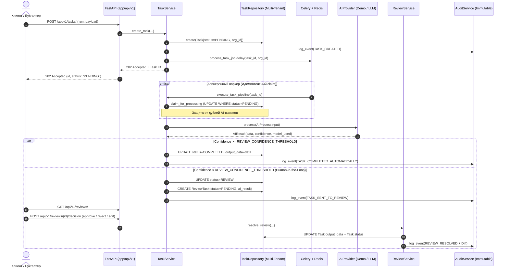

# OneFlow — Универсальный технический фундамент SaaS-платформы автоматизации

> **Назначение OneFlow**: Модульное, масштабируемое ядро для будущих решений автоматизации казахстанского учета и смежных бизнес-процессов. Ядро намеренно абстрагировано от конкретных прикладных сценариев (OCR, сопоставления номенклатур, парсинга банковских выписок, специфичных правил Kaspi/1С/ЭДО) и готово к интеграции **любой продуктовой гипотезы** в виде изолированного workflow без переписывания архитектуры.

---

## 1. Архитектурный обзор и поток данных

### Поток обработки задачи (End-to-End Pipeline)



---

## 2. Стек технологий и обоснование решений

* **Backend**: **Python 3.12+ / FastAPI / Pydantic v2**
  * Строгая статическая типизация, высокая производительность асинхронного ввода-вывода (ASGI).
* **База данных**: **PostgreSQL 16 + SQLAlchemy 2.0 (Async) + Alembic**
  * `JSONB` для гибких схем входных и выходных данных задач без изменения структуры таблиц.
  * Триггерная защита на уровне PostgreSQL (`BEFORE UPDATE OR DELETE ON audit_logs`), гарантирующая неизменяемость (immutability) журнала аудита.
  * Для локальной разработки и unit/smoke тестов поддерживается zero-setup режим на `SQLite + aiosqlite` с аналогичными триггерами неизменяемости.
* **Очередь задач**: **Celery + Redis**
  * *Почему Celery, а не FastAPI BackgroundTasks*: AI-вызовы и тяжелые алгоритмические обработки могут занимать от единиц до десятков секунд. Выполнение их внутри HTTP-сервера исчерпывает пул обработчиков и приводит к потере задач при редеплое или падении сервера. Celery выносит задачи в изолированные воркеры с поддержкой очередей, ограничений повторных попыток (retries) и таймаутов.
  * *Идемпотентность*: Воркер атомарно переводит статус задачи из `PENDING` в `PROCESSING`. Если задача уже была захвачена или выполнена, повторный AI-вызов блокируется.
  * *Режим тестирования*: Для локальных тестов без Redis поддерживается `CELERY_TASK_ALWAYS_EAGER=true`.
* **Frontend**: **Vue 3 + TypeScript + Vite + Pinia + Naive UI**
  * *Почему Naive UI, а не PrimeVue*:
    1. Написан на 100% на TypeScript специально под Vue 3 — максимальная автодополняемость и надежность типов.
    2. Полноценная поддержка Dark/Light тем «из коробки» без внешних громоздких CSS-пресетов через `NConfigProvider`.
    3. Идеальный набор компонентов для B2B/SaaS (`NDataTable`, `NStatistic`, `NBadge`, `NModal`, `NUpload`).
  * *Решение проблемы SameSite для refresh-cookie*:
    В режиме разработки Vite использует reverse proxy (`/api` -> `http://localhost:8000`). Фронтенд обращается к бэкенду как к first-party источнику (`http://localhost:5173/api/...`), благодаря чему `SameSite=Lax` и `httpOnly` куки работают штатно без CORS/SameSite блокировок браузера.
* **Хранилище файлов**:
  * Абстракция `StorageBackend` с реализацией `LocalStorageBackend` для MVP и готовой точкой расширения под S3/MinIO.
  * Проверка MIME-типов по содержимому (magic-байты заголовков файлов: `%PDF-`, `\x89PNG`, `\xff\xd8\xff`, `PK\x03\x04`), исключающая загрузку замаскированных исполняемых файлов (.exe/.sh).
  * Soft-delete (`deleted_at`) для сохранения файла в целях финансово-хозяйственного аудита.

---

## 3. Структура проекта

```text
RPROJECT X/
├── backend/
│   ├── app/
│   │   ├── api/v1/             # HTTP роуты (auth, tasks, review, files, dashboard, audit)
│   │   │                       # Внимание: api/ НЕ импортирует models/ и repositories/ напрямую!
│   │   ├── core/               # Конфиг (Settings), безопасность (JWT/bcrypt), сессии БД
│   │   ├── models/             # SQLAlchemy 2.0 декларативные модели
│   │   ├── schemas/            # Pydantic v2 схемы запросов и ответов
│   │   ├── services/           # Бизнес-логика, FSM-переходы, Diff-анализ
│   │   ├── repositories/       # Доступ к БД с жестким контролем multi-tenancy (BaseRepository)
│   │   ├── workers/            # Celery задачи и конфигурация
│   │   ├── integrations/       # StorageBackend (Local, S3) и валидация файлов
│   │   └── ai/                 # AIProvider: контракты, DemoAIProvider, LLMProvider
│   ├── alembic/                # Миграции структуры БД
│   ├── scripts/                # seed.py (наполнение тестовыми данными)
│   ├── tests/                  # Pytest smoke и интеграционные тесты
│   ├── Dockerfile
│   └── requirements.txt
├── frontend/
│   ├── src/
│   │   ├── api/                # Axios клиент с интерцептором 401 и авто-обновлением токена
│   │   ├── components/         # StatusBadge, AppLayout
│   │   ├── router/             # Маршрутизация с guards авторизации
│   │   ├── stores/             # Pinia stores (auth, theme)
│   │   ├── types/              # TypeScript интерфейсы
│   │   └── views/              # Login, Dashboard, Tasks, TaskDetail, Review, Files, Settings
│   ├── Dockerfile
│   ├── nginx.conf
│   └── package.json
├── docker-compose.yml          # Оркестрация: backend, frontend, postgres, redis, celery
├── .env.example                # Шаблон конфигурации
└── README.md
```

---

## 4. Переменные окружения (.env)

| Переменная | Значение по умолчанию | Описание |
| :--- | :--- | :--- |
| `ENV` | `development` | Окружение запуска (`development`, `production`, `test`) |
| `DEBUG` | `true` | Флаг отладочного режима |
| `DATABASE_URL` | `sqlite+aiosqlite:///./saas.db` | Строка подключения к БД (SQLite локально или PostgreSQL в проде/Docker) |
| `REDIS_URL` | `redis://localhost:6379/0` | URL подключения к Redis брокеру |
| `CELERY_BROKER_URL` | `redis://localhost:6379/0` | URL очереди Celery |
| `CELERY_RESULT_BACKEND` | `redis://localhost:6379/0` | URL бэкенда результатов Celery |
| `CELERY_TASK_ALWAYS_EAGER` | `false` | Если `true`, задачи выполняются синхронно в процессе (для тестов) |
| `JWT_SECRET_KEY` | *(строка 32+ символа)* | Секретный ключ подписи JWT токенов |
| `ACCESS_TOKEN_EXPIRE_MINUTES` | `15` | Время жизни короткоживущего Access Token |
| `REFRESH_TOKEN_EXPIRE_DAYS` | `7` | Время жизни Refresh Token (в httpOnly cookie) |
| `COOKIE_NAME` | `refresh_token` | Имя куки для refresh токена |
| `COOKIE_SAMESITE` | `lax` | Политика SameSite (`lax`, `none`, `strict`) |
| `COOKIE_SECURE` | `false` | Флаг Secure для HTTPS (в проде обязательно `true`) |
| `REVIEW_CONFIDENCE_THRESHOLD` | `0.85` | **Порог уверенности AI**: задачи с confidence ниже этого значения уходят на проверку человеку |
| `DEMO_MODE` | `true` | Режим работы без внешних платных LLM ключей |
| `AI_PROVIDER` | `demo` | Выбранный провайдер (`demo` или `llm`) |
| `OPENAI_API_KEY` | `""` | Ключ доступа к OpenAI-совместимому API (при `AI_PROVIDER=llm`) |
| `STORAGE_BACKEND` | `local` | Тип хранилища файлов (`local` или `s3`) |
| `UPLOAD_DIR` | `./uploads` | Локальный каталог сохранения файлов |
| `MAX_UPLOAD_SIZE_BYTES` | `26214400` | Максимальный размер загружаемого файла (25 МБ) |
| `CORS_ORIGINS` | `["http://localhost:5173", ...]` | Явный список доверенных источников CORS |

---

## 5. Быстрый запуск

### Вариант А: Запуск через Docker (одной командой)

Требуется установленный Docker и Docker Compose.

```bash
# 1. Склонировать репозиторий и подготовить .env
cp .env.example .env

# 2. Запустить все сервисы (PostgreSQL, Redis, Celery, Backend, Frontend)
docker compose up --build
```

* Веб-интерфейс доступен по адресу: **http://localhost:5173** (или http://localhost)
* API Swagger / Документация: **http://localhost:8000/docs**
* Healthcheck: **http://localhost:8000/health**

---

### Вариант Б: Запуск локально без Docker

#### 1. Backend

```bash
cd backend

# Создать и активировать виртуальное окружение
python -m venv .venv
# Windows:
.\.venv\Scripts\activate
# Linux/macOS:
# source .venv/bin/activate

# Установить зависимости
pip install -r requirements.txt

# Наполнить БД демонстрационными данными (SQLite создается автоматически)
python scripts/seed.py

# Запустить API сервер
uvicorn app.main:app --reload --port 8000
```

#### 2. Frontend

```bash
cd frontend

# Установить зависимости
npm install

# Запустить dev-сервер с настроенным проксированием
npm run dev
```

Откройте в браузере: **http://localhost:5173**

---

### Тестовые учетные записи (после `seed.py`):

1. **Организация 1 (ТОО Базис-Аудит)**:
   * Администратор: `admin@example.kz` / Пароль: `Secret123!`
   * Бухгалтер: `user@example.kz` / Пароль: `Secret123!`
2. **Организация 2 (ТОО Степь Логистик)** — для проверки мультиарендности:
   * Администратор: `other@example.kz` / Пароль: `Secret123!`

---

## 6. Запуск тестов

Тестовый набор покрывает регистрацию, аутентификацию, httpOnly refresh cookie, multi-tenancy изоляцию, конечный автомат (FSM), Human-in-the-Loop Review, валидацию файлов по сигнатурам и триггеры неизменяемости аудита:

```bash
cd backend
.\.venv\Scripts\pytest -v
```

---

## 7. Руководства по расширению платформы

### Инструкция: Как добавить новый Task Type

1. Откройте `backend/app/models/entities.py` и добавьте новое значение в `TaskType`:
   ```python
   class TaskType(str, enum.Enum):
       # Существующие типы...
       KASPI_STATEMENT_IMPORT = "KASPI_STATEMENT_IMPORT"
   ```
2. Откройте `frontend/src/types/index.ts` и добавьте новый тип в TypeScript enum:
   ```typescript
   export type TaskType = 
     | 'DOCUMENT_PROCESSING'
     | 'KASPI_STATEMENT_IMPORT';
   ```
3. В `frontend/src/views/TasksView.vue` добавьте элемент в `typeOptions`:
   ```typescript
   { label: 'KASPI_STATEMENT_IMPORT', value: 'KASPI_STATEMENT_IMPORT' }
   ```
Ядро, FSM-автомат и очередь готовы обрабатывать этот тип без каких-либо изменений логики!

---

### Инструкция: Как добавить новый AI Workflow, не трогая ядро

1. Откройте `backend/app/ai/` и добавьте обработчик для нового типа в `AIProvider` или создайте кастомный провайдер в `backend/app/ai/custom_provider.py`:
   ```python
   from app.ai.provider import AIProvider
   from app.ai.schemas import AIProcessInput, AIResult

   class CustomWorkflowProvider(AIProvider):
       async def process(self, input_data: AIProcessInput) -> AIResult:
           if input_data.task_type == "KASPI_STATEMENT_IMPORT":
               # Кастомная логика парсинга/модели
               return AIResult(
                   data={"extracted_operations": 42},
                   confidence=0.92,
                   model_used="kaspi-transformer-v1"
               )
           # Fallback...
   ```
2. Зарегистрируйте новый провайдер в фабрике `backend/app/ai/factory.py`.
3. Все сервисы (`TaskService`, `ReviewService`), воркеры и API продолжат работать с новым workflow прозрачно!

---

### Инструкция: Как заменить LocalStorage на S3 / MinIO

1. Создайте класс `S3StorageBackend` в `backend/app/integrations/storage/s3.py`, реализующий интерфейс `StorageBackend`:
   ```python
   import aioboto3
   from app.integrations.storage.base import StorageBackend

   class S3StorageBackend(StorageBackend):
       def __init__(self, bucket: str, endpoint_url: str = None):
           self.bucket = bucket
           self.endpoint_url = endpoint_url
           self.session = aioboto3.Session()

       async def save(self, file_bytes: bytes, filename: str, organization_id: str) -> str:
           key = f"{organization_id}/{filename}"
           async with self.session.client("s3", endpoint_url=self.endpoint_url) as s3:
               await s3.put_object(Bucket=self.bucket, Key=key, Body=file_bytes)
           return key

       async def get(self, stored_path: str) -> bytes:
           async with self.session.client("s3", endpoint_url=self.endpoint_url) as s3:
               resp = await s3.get_object(Bucket=self.bucket, Key=stored_path)
               return await resp["Body"].read()

       async def delete(self, stored_path: str) -> bool:
           async with self.session.client("s3", endpoint_url=self.endpoint_url) as s3:
               await s3.delete_object(Bucket=self.bucket, Key=stored_path)
               return True

       async def get_url(self, stored_path: str) -> str:
           async with self.session.client("s3", endpoint_url=self.endpoint_url) as s3:
               return await s3.generate_presigned_url("get_object", Params={"Bucket": self.bucket, "Key": stored_path})
   ```
2. В файле `backend/app/integrations/storage/factory.py` подключите создание `S3StorageBackend` при `settings.STORAGE_BACKEND == "s3"`.
3. Ни один сервис (`FileService`) и ни один HTTP-эндпоинт не требуют изменений!

---

## 8. Интеграция с 1С:Предприятие (1C OData Layer)

Интеграция выполнена как изолированный модуль `app/integrations/onec/`, не нарушающий архитектурные границы ядра.

### Как подключить 1С для локальной разработки:

1. **Вариант 1 (Облачный 1C:Fresh триал)**:
   * Зарегистрируйте бесплатный 30-дневный демо-доступ на [1cfresh.kz](https://1cfresh.kz) или [1cfresh.com](https://1cfresh.com).
   * В личном кабинете скопируйте URL опубликованного приложения (например, `https://1cfresh.kz/a/buhkz/odata/standard.odata`).
   * В `.env` или настройках организации укажите:
     ```env
     ONEC_ODATA_URL=https://1cfresh.kz/a/buhkz/
     ONEC_USERNAME=your_fresh_user
     ONEC_PASSWORD=your_fresh_password
     ```
2. **Вариант 2 (Локальная база с веб-публикацией OData)**:
   * В 1С:Предприятие (версия платформы 8.3.14+) откройте конфигуратор базы («Бухгалтерия для Казахстана» или демо-база).
   * Выберите меню: **Администрирование → Публикация на веб-сервере...**.
   * Укажите имя публикации (например, `accounting`) и обязательно отметьте галочкой пункт **«Публиковать стандартный интерфейс OData»**.
   * Нажмите «Опубликовать» (требуется локальный IIS или Apache).
   * Адрес OData будет доступен по шаблону: `http://localhost/accounting/odata/standard.odata/`.
3. **Вариант 3 (Режим Demo/Mock без установленной 1С)**:
   * Если URL 1С не задан, адаптер автоматически работает в **детерминированном mock-режиме**, возвращая реалистичные казахстанские данные (с реальными форматами БИН/ИИН, суммами в тенге KZT и счетами IBAN), что позволяет тестировать все сценарии без внешнего сервера 1С.

### Безопасность и модель уровней риска (Risk Levels):

Операции строго типизированы по шкале уровней риска:
* **L0 (`SAFE_READ`)**: Диагностика, системные метаданные, нечувствительные справочники (`read.system.health_check`, `read.documents.get_unposted`).
* **L1 (`ANALYTICS_READ`)**: Сводные отчеты, остатки по складам, анализ задолженности (`read.analytics.get_debtors`, `read.warehouse.get_inventory`).
* **L2 (`SENSITIVE_READ`)**: Персональные данные, зарплатные ведомости, конфиденциальные контракты.
* **L3 (`WRITE_DRAFT`)** / **L4 (`WRITE_POST`)** / **L5 (`DESTRUCTIVE`)**: Любые модифицирующие операции.

> [!IMPORTANT]
> **Двойной предохранитель записи (Dual-Safety Latch)**:
> Запись в 1С **заблокирована по умолчанию** глобальным флагом `ONEC_READ_ONLY_MODE=true` в соответствии с текущим ограничением проекта (killer-фича не выбрана). Любая попытка записи отклоняется до сетевого вызова.
> Кроме того, деструктивные операции (`raw_odata_query`, прямой SQL, исполнение произвольного кода) находятся в жестком запрещенном списке (`FORBIDDEN_OPERATIONS`) и блокируются безусловно.

### Фильтрация вывода (Output Filter):

Перед тем как данные из 1С передаются в AI-контекст или ответ API:
1. Автоматически маскируются казахстанские идентификаторы:
   * **БИН / ИИН** (12 цифр): `981240001122` → `9812******22`.
   * **IBAN счета** (20 символов): `KZ120000000000123456` → `KZ12************3456`.
   * **Банковские карты**: `4400-****-****-1234`.
2. Включается ограничение `max_rows` (по умолчанию 100 строк), исключающее переполнение контекстного окна языковых моделей.

---

## 9. Пошагово: Как добавить новую read-only операцию в 1С

1. Откройте `backend/app/integrations/onec/operations.py`.
2. Создайте метод в классе `OneCOperationsService` с декоратором `@requires_risk_level`:
   ```python
   @requires_risk_level(RiskLevel.ANALYTICS_READ)
   async def get_turnover_balance(
       self, account_code: str = "3310", limit: int = 50, user_id: Optional[str] = None
   ) -> Dict[str, Any]:
       """
       Taxonomy: read.analytics.get_turnover_balance
       Получение оборотно-сальдовой ведомости по счету (например, 3310 - расчеты с поставщиками).
       """
       operation_name = "read.analytics.get_turnover_balance"

       async def _exec():
           if self.is_mock or not self.client:
               return [{"account": account_code, "debit_turnover": 450000, "credit_turnover": 380000}]

           # В реальной 1С: выборка через onec-odata
           filter_expr = F("Счет") == account_code
           return await self.client.list_accumulation_register(
               "Хозрасчетный_Обороты", top=limit, filter_expr=filter_expr
           )

       return await self._execute_with_guards(
           operation_name=operation_name,
           risk_level=RiskLevel.ANALYTICS_READ,
           params={"account_code": account_code, "limit": limit},
           executor_func=_exec,
           user_id=user_id,
       )
   ```
3. Метод автоматически получит:
   * Предварительную проверку политики доступа и лимита риска.
   * Запись события в неизменяемый журнал `audit_logs`.
   * Автоматическое маскирование БИН/ИИН и ограничение количества строк перед передачей в AI-модель!

---

## 10. Источники и лицензии сторонних материалов

* **onec-odata** (Python, MIT License, автор: Eugene Finskiy)
  * Репозиторий: [https://github.com/efinskiy/onec-odata](https://github.com/efinskiy/onec-odata)
  * Роль: Внешняя библиотека-зависимость в `requirements.txt` для прямого взаимодействия с OData v3 1С:Предприятия.
* **ashybulakstroy-mcp-1c-bridge** (Python, MIT License)
  * Репозиторий: [https://github.com/ashybulakstroy/ashybulakstroy-mcp-1c-bridge](https://github.com/ashybulakstroy/ashybulakstroy-mcp-1c-bridge)
  * Роль: Источник концепций безопасности (шкала уровней риска L0-L5, список безусловно запрещенных операций, маскирование конфиденциальных данных перед передачей в LLM). Реализовано независимо на архитектуре проекта.
* **1c-odata-mcp** (TypeScript, MIT License)
  * Репозиторий: [https://github.com/evilbruce666/1c-odata-mcp](https://github.com/evilbruce666/1c-odata-mcp)
  * Роль: Источник паттернов безопасности (двойной предохранитель записи, учет особенности OData с символом `+` / `%20`, таксономия наименования операций `read.<category>.<action>`).

Полный текст лицензий и официальные уведомления зафиксированы в файле [THIRD_PARTY_NOTICES.md](file:///c:/Users/timur/OneDrive/Рабочий%20стол/RPROJECT%20X/THIRD_PARTY_NOTICES.md).
